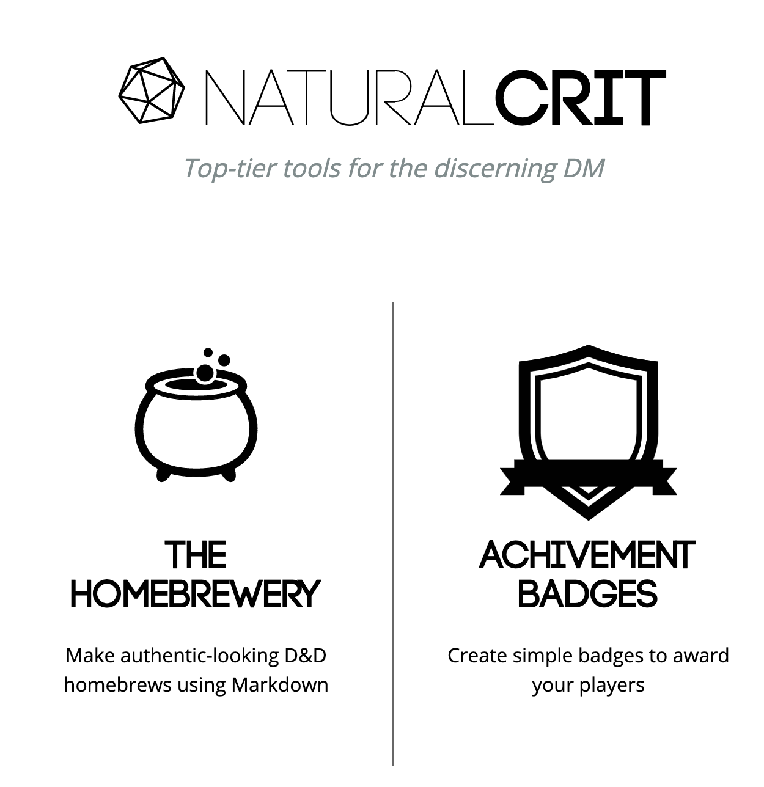
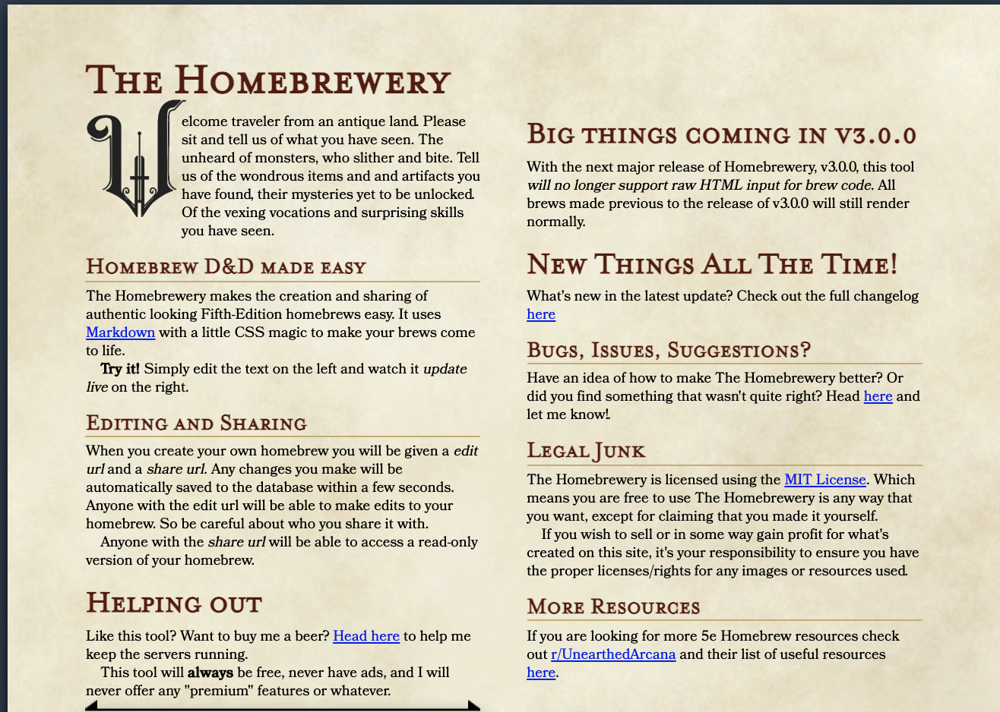
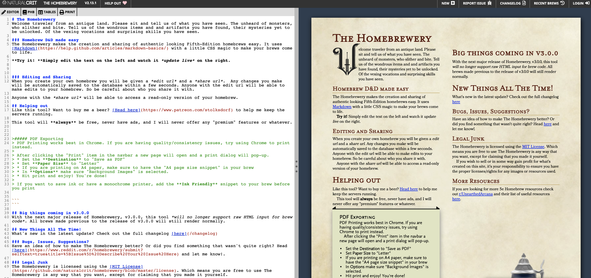
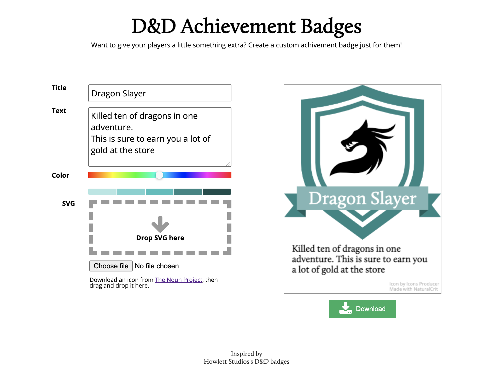

# Naturalcrit
Top-tier tools for the discerning D&amp;D DM

# Features
The Main features that are currently built into Natural Crit are:\
### *The HomeBrewery*\
### *Achievment Badges*
![Image of the main page]

## The HomeBrewery
The HomeBrewery allows for a DM to create authentic looking homebrews that suit the traditional dnd theme that we all know and love. 
![Example 1 of the editor]
#### Completle freedom
This top-tier editor allows for even the average DM to be able to create amazing Documents.
Adding Images, headings, Help boxes and links. All created in our own modified version of markdown that suits the needs of the DM.
*Code blocks* and *HTML* elements are supported throughout your homebrews.
![Example 2 of the editor]

## Achievment Badges
Achievment badges are one of the great additions that can be used to make your campaign so much better for your players. Creating an achievment to recognise players achievments creates a better experience and sense of progression. It can also be used to help end, continue or shove your players onto the right path.
![Icon Builder]

---

##### Naturalcrit