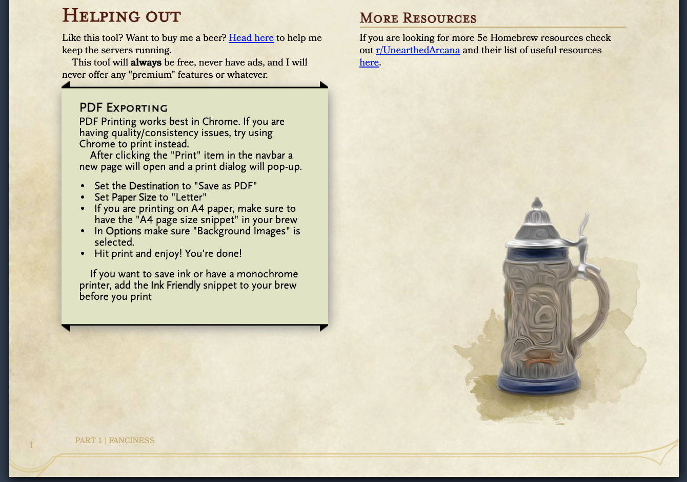

# Naturalcrit
Top-tier tools for the discerning D&amp;D DM

# Features
The Main features that are currently built into Natural Crit are:
### *The HomeBrewery*
### *Achievement Badges*

## The HomeBrewery
The HomeBrewery allows for a DM to create authentic-looking homebrews that suit the traditional dnd theme that we all know and love.  
 

#### Completle freedom
This top-tier editor allows for even the average DM to be able to create amazing Documents.
Adding Images, headings, Help boxes and links. All were created in our own modified version of markdown that suits the needs of the DM.
*Code blocks* and *HTML* elements are supported throughout your homebrews.

## Achievement Badges
Achievement badges are one of the great additions that can be used to make your campaign so much better for your players. Creating an achievement to recognise players achievements creates a better experience and sense of progression. It can also be used to help end, continue or shove your players onto the right path.

---

##### Naturalcrit